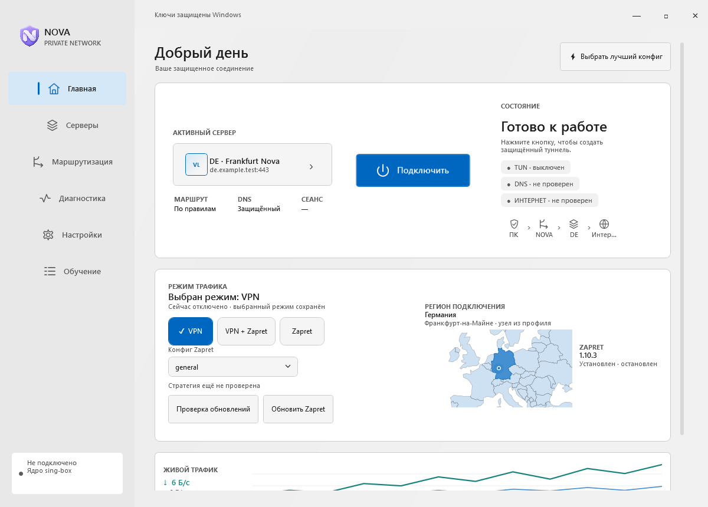
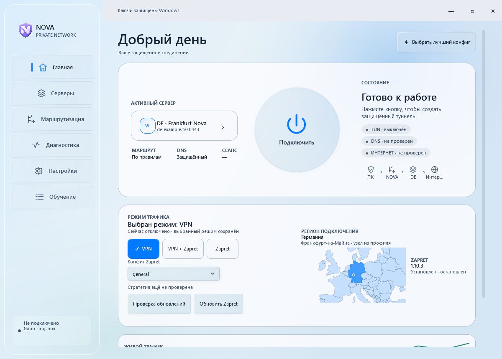
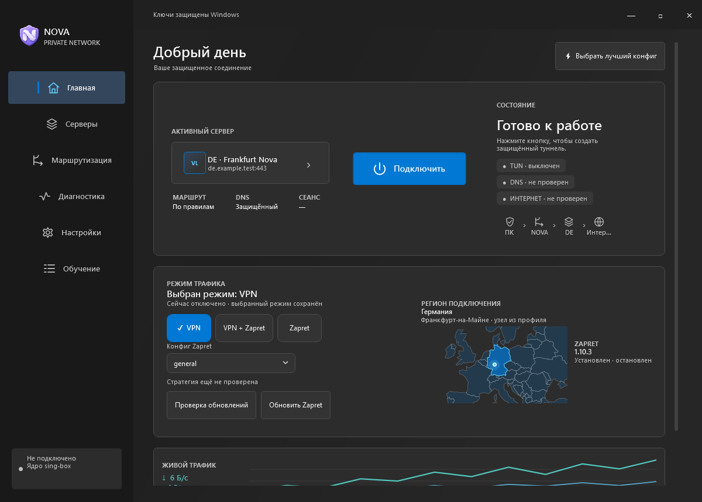
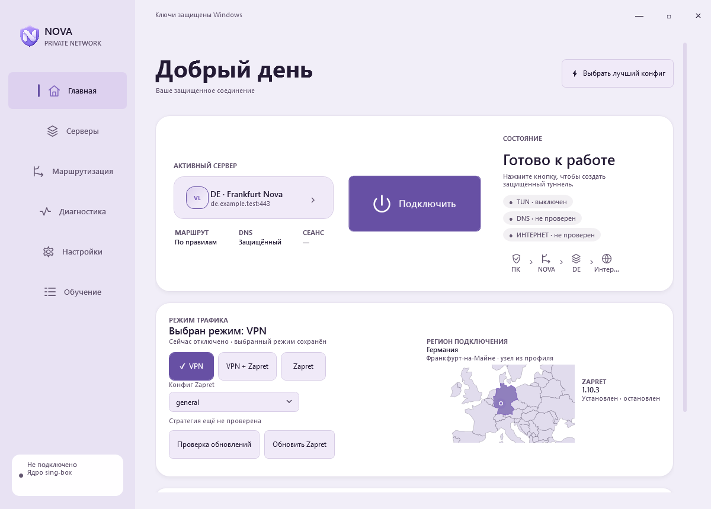
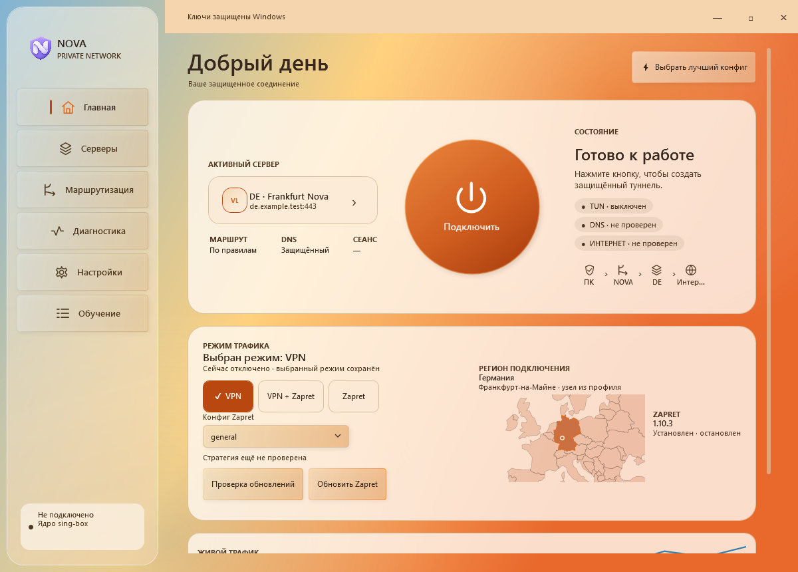
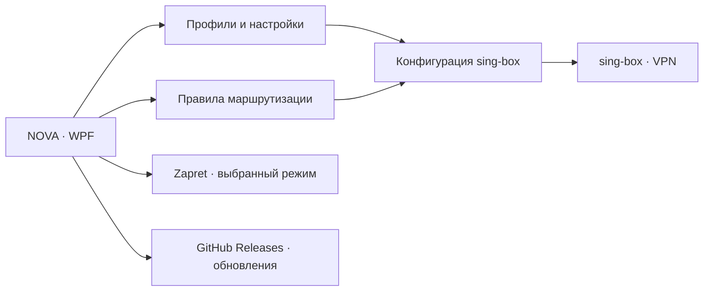

# NOVA VPN

**Русский** | [English](README.en.md)

Графический VPN-клиент для Windows на **C# + WPF** с ядром [**sing-box**](https://github.com/SagerNet/sing-box).
Добавьте свой профиль или подписку, выберите сервер и нажмите кнопку подключения.
Настройте маршруты для сайтов и приложений, выберите оформление и проверяйте обновления прямо в клиенте.

**[Скачать последнюю версию](https://github.com/leoraijin/NOVA-VPN/releases/latest)** · [Что нового](CHANGELOG.md) · [Помощь](SUPPORT.md)

  

  

Скриншоты версии 2.3.16 сделаны в демонстрационном режиме. Серверы и маршруты — примеры; подключение не запускалось.

## Что как называется

| Компонент | Назначение |
| --- | --- |
| **NOVA VPN** | Интерфейс, профили, маршрутизация, диагностика и обновления |
| **sing-box** | Сетевое ядро: туннель, DNS и применение маршрутов |
| **Zapret** | Отдельный компонент обработки трафика для соответствующих режимов |
| **NOVA-VPN-Android** | [Отдельный Android-клиент](https://github.com/leoraijin/NOVA-VPN-Android) |

Этот репозиторий содержит **Windows-установщики и документацию**. Автоматические архивы GitHub «Source code» содержат файлы репозитория, а не исходники приложения или установщик.

## Платформы и статус

| Платформа | Где скачать | Статус |
| --- | --- | --- |
| **Windows** | [GitHub Releases](https://github.com/leoraijin/NOVA-VPN/releases/latest) | Выпущена 2.3.17; проверки — в [STATUS](docs/STATUS.md) |
| **Android** | [Отдельный репозиторий](https://github.com/leoraijin/NOVA-VPN-Android) | Развивается отдельно; Windows-установщик для телефона не подходит |

## Возможности

- **Профили и подписки.** Добавление конфигураций, выбор сервера и переключение профилей.
- **Маршрутизация.** Правила для сайтов и приложений; правило сайта применяется раньше правила браузера.
- **Режимы.** VPN, VPN + Zapret и Zapret с явным отображением выбранного режима.
- **Диагностика.** Состояние туннеля и DNS, проверки соединения, журнал событий.
- **Хранение профилей.** Состояние защищается Windows DPAPI в учётной записи пользователя. Полный экспорт с профилями содержит секреты.
- **Оформление.** Liquid Glass, One UI, Windows Light, Windows Dark и Amber Glass; карта региона использует палитру темы.
- **Обновления.** Проверка выпусков GitHub и сводка изменений после обновления.

## Быстрый старт

1. Откройте [последний выпуск](https://github.com/leoraijin/NOVA-VPN/releases/latest) и скачайте **установщик `.exe` из Assets**.
2. Запустите установщик и выберите папку. Windows может запросить права администратора для сетевых компонентов.
3. В разделе **Серверы** добавьте ваш профиль или подписку.
4. Выберите сервер и режим, затем нажмите **Подключить**.
5. Правила сайтов и приложений задаются в разделе **Маршрутизация**.

Установщик не содержит VPN-ключей или подписок. Для подключения нужна собственная конфигурация сервера.

Подробнее: [установка и обновления](docs/INSTALLATION.md) · [приоритет маршрутов](docs/ROUTING.md).

## Оформление

Темы сохраняют расположение основных действий. Изменяются палитра, материалы, форма кнопок и визуальные эффекты.

| Windows Light | Windows Dark |
| --- | --- |
|  |  |

| One UI | Amber Glass |
| --- | --- |
|  |  |

[Подробнее о темах](docs/DESIGN.md). Названия стилей обозначают оформления NOVA; приложение не связано с Apple, Samsung или Microsoft.

## Как это устроено

## Документация

| Файл | О чём |
| --- | --- |
| [docs/README.md](docs/README.md) | Оглавление |
| [docs/INSTALLATION.md](docs/INSTALLATION.md) | Установка, обновление и перенос |
| [docs/ROUTING.md](docs/ROUTING.md) | Правила сайтов и приложений |
| [docs/DESIGN.md](docs/DESIGN.md) | Пять тем оформления |
| [docs/STATUS.md](docs/STATUS.md) | Проверки и ограничения |
| [SUPPORT.md](SUPPORT.md) | Сообщения об ошибках |
| [CHANGELOG.md](CHANGELOG.md) | Последние изменения |
| [THIRD_PARTY.md](THIRD_PARTY.md) | Сторонние компоненты |

## Лицензирование

Лицензия на собственный код NOVA VPN в этом репозитории пока не объявлена. Поэтому здесь нет заявления об открытой лицензии на приложение. Сторонние компоненты распространяются на своих условиях; уведомления включены в установщик. Подробнее: [THIRD_PARTY.md](THIRD_PARTY.md).
