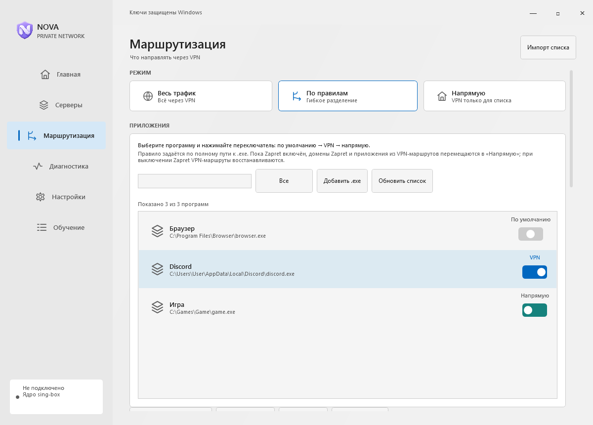

# Маршрутизация

Правила сайтов и Windows-приложений задаются в разделе **Маршрутизация**.

## Приоритет

| Правило браузера | Правило сайта | Маршрут сайта |
| --- | --- | --- |
| Напрямую | Через VPN | Через VPN |
| Через VPN | Напрямую | Напрямую |

Правило сайта применяется раньше правила браузера. Поведение исправлено в 2.3.14 и проверялось для обычных и импортированных sing-box конфигураций.

## Режимы

- **VPN** — VPN-туннель с выбранными правилами.
- **VPN + Zapret** — совместный режим компонентов.
- **Zapret** — отдельный режим Zapret.

Активный режим отображается на главной странице. Для YouTube и Discord в режиме VPN + Zapret существуют специальные переходы маршрутов; это отдельная логика от обычного приоритета сайта над браузером.

При неожиданном маршруте проверьте доменное правило, правило приложения и режим. Укажите их в сообщении об ошибке вместе с версией клиента.
